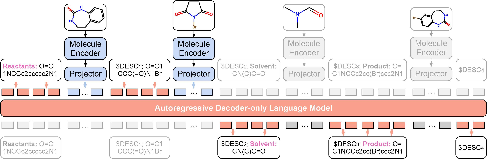
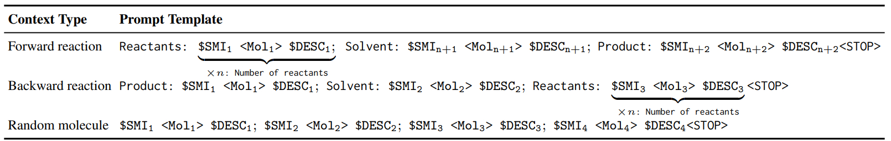
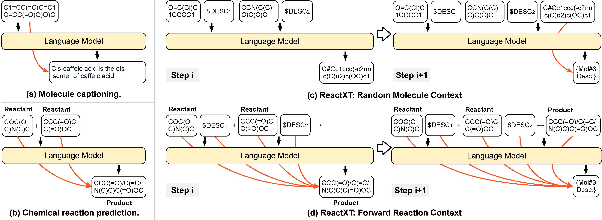
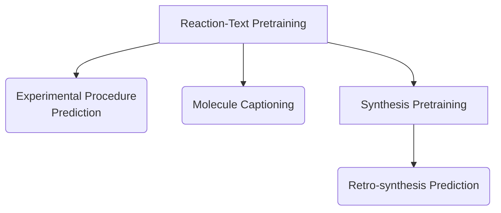

# ReactXT: Understanding Molecular “Reaction-ship” via Reaction-Contextualized Molecule-Text Pretraining

This repo contains the pytorch implementation of our ACL 2024 paper.

[[paper](https://www.arxiv.org/abs/2405.14225)], [[Homepage](https://syr-cn.github.io/ReactXT/)], Demo

Authors: Zhiyuan Liu*, Yaorui Shi*, An Zhang, Sihang Li, Enzhi Zhang, Xiang Wang†, Kenji Kawaguchi, Tat-Seng Chua

\* Equal Contribution

† Corresponding

## Framework of ReactXT



We propose **React**ion-Conte**xt**ualized Molecule-Text Pretraining (ReactXT), a new pretraining method for reaction-text modeling.
- ReactXT incorporates chemical reactions, instead of only single molecules, into the pretraining process.
- ReactXT is good at both reaction-text generation and molecule-text generation downstream tasks.




ReactXT aims to improve React-Text modeling by introducing three types of input contexts.
- **Forward reaction**: The forward reaction context contains molecule roles (Reactant/Catalyst/Solvent/Product), molecule SMILES, and 2D molecular graph embeddings.
- **Backward reaction**: Similar to the forward context but with the order of molecular roles reversed. Suppose the forward context prediction trains the model to predict the product from the reactants, then the backward context prediction trains the model to predict the reactant from the product.
- **Random molecule**: A small amount of random molecules are also included to ensure the LM retains the capability to describe individual molecules outside chemical reactions.


## Comparison to previous molecule-text generative modeling methods



Most prior works either focus on generating the textual description of a single molecule, or apply LMs for chemical reaction prediction without including the textual descriptions of molecules/reactions in context.
In contrast, ReactXT integrates **both molecule-text and reaction contexts** into the pretraining process, which enables the model to generate both molecule captions and reaction components.


## Requirements

The requirements of this repo are detailed in `requirements.txt`. To create a new environment `reactxt`, run the following command:

```bash
conda create -n reactxt python=3.8
conda activate reactxt
pip install -r requirements.txt
```

## Reproduce the results

Our datasets and pretrained model checkpoints can be downloaded from [here](https://osf.io/e68v4/files/osfstorage).

The datasets should be placed in the `./data/` directory, and the pretrained model checkpoints should be placed in the `./all_checkpoints/` directory. If done correctly, the folders may look like this:
```
data
├── action_data
├── caption_data
├── ChEBI-20_data
├── pretrain_data
│   └── reactions
└── synthesis_data
    ├── USPTO_50K_PtoR
    │   ├── test
    │   ├── train
    │   └── val
    └── USPTO_50K_PtoR_aug20
        ├── test
        ├── test_noaug
        ├── train
        └── val
all_checkpoints
├── pretrain_hybrid
│   └── last.ckpt
└── synthesis_pretrain
    └── last.ckpt
```

Below is the workflow of finetuning on the downstream tasks:


### Reaction-Contextualized Molecule-Text Pretraining

Please run the following command to perform ReactXT pretraining based on the MolCA checkpoint.
The original MolCA checkpoint can be downloaded from [MolCA](https://github.com/eltociear/MolCA).
This script uses both the reaction context and single molecule captioning to train the model, which corresponds to the experimental settings in the last row of our paper's Table 8.

```bash
bash scripts/run_pretrain.sh
```

After the pretraining step, the model will be saved in the `./all_checkpoints/` directory. You may use the `convert.py` to combine the model checkpoints. 

### Finetuning on downstream tasks

1. **Experimental Procedure Prediction on OpenExp**

For the code to **process the OpenExp** dataset, refer to `openExp/README.md`.

Please run the following command to finetune the pretrained model on the OpenExp dataset. The script will reproduce the experimental result in Table 5.

```bash
bash scripts/run_action.sh
```

Since LMs with different tokenizers are compared in the paper, we use an external tokenizer to read the results for fair comparisons. Please use `read_results/read_results.py` to read the results.

2. **Molecule Captioning on PubChem324k and CheBI-20**

Please run the following commands to finetune the pretrained model on PubChem324k and CheBI-20. The script will reproduce the experimental result in Table 6. The results are recorded in the output files.

```bash
bash scripts/run_caption.sh
bash scripts/run_chebi.sh
```

3. **Retro-synthesis Prediction on USPTO-50k**

Please run the following commands to finetune the pretrained model on USPTO-50k. The script will reproduce the experimental result in Table 7.

- Following R-SMILES, we use a 20-times augmented dataset for training and testing. The augmented dataset is included in the above download link. For more details about the augmentation, please refer to [R-SMILES](https://github.com/otori-bird/retrosynthesis).

- Following R-SMILES and AT, we train the model on USPTO-full before the USPTO-50k dataset. The model checkpoint trained on USPTO-full is also included in the above download link (./all_checkpoints/synthesis_pretrain/last.ckpt). The following script will fine-tune the model on USPTO-50k based on this checkpoint. If you are interested in the training process on USPTO-full, please download the augmented dataset from [R-SMILES](https://github.com/otori-bird/retrosynthesis).

```bash
bash scripts/run_retro.sh
```

The generated results will be saved in `./all_checkpoints/`. Please use `read_results/score.py` to get the top-1~10 accuracy and valid rate.


# Citation

If you find this paper useful, please cite us:

```bib
@inproceedings{liu2024reactxt,
    title={ReactXT: Understanding Molecular “Reaction-ship” via Reaction-Contextualized Molecule-Text Pretraining},
    author={Liu, Zhiyuan and Shi, Yaorui and Zhang, An and Li, Sihang and Zhang, Enzhi and Wang, Xiang and Kawaguchi, Kenji and Chua, Tat-Seng},
    booktitle={Findings of the Association for Computational Linguistics: {ACL} 2024},
    publisher={Association for Computational Linguistics},
    year={2024},
    url={https://openreview.net/forum?id=V-ejDfLiwe}
}
```
